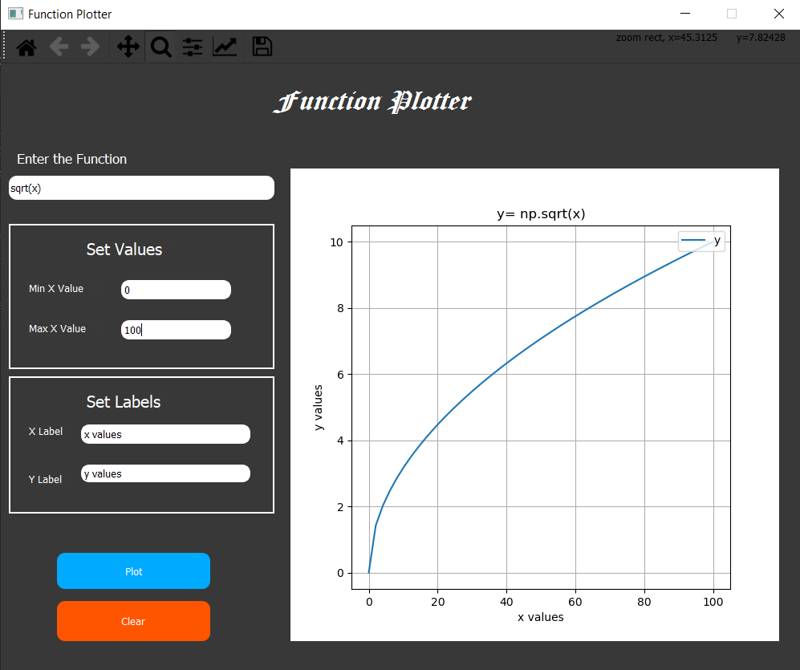

# Function Plotter 
Gui Python Application takes a function of x and takes min and max values of x from the user and plot the function the given information. The following operators must be supported: + - / * ^.

## Techonology
* python programming Lanuage : for the main login
* Matplotlib : for Drawing graphs
* PYQT5 : for UI and Design
* pytest : for testing

## Installations
You should have  Python (+3.6.0).
un the following commands:\
      * ``` pip install numpy```\
      * ``` pip install matplotlib```\
      * ``` pip install PyQt5```\
      * ``` pip install pytest```\
Run the program \
      * ``` python ./main.py```\
Run test \
      * ``` pytest .\test.py```
      
## Examples
### Design

### Different Orders Functions



### errors


