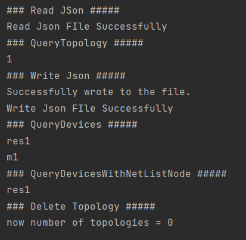

# Topology API

### Introduction
Topology : API library which does the following:
1. Read and write topologies to and from disk.
2. Stores multiple topologies in memory.
3. Execute operations on topologies.

### Techonolgies
Java: Programming language for the main Logic
JUnit : for Unit testing
JavaDoc : for Documentation

### Main API METHODS IN TopologyApi:
```
ReadJson()
Read a topology from a given JSON file and store it in the memory.

WriteJson()
Write a given topology from the memory to a JSON file.

QueryTopology()
Query about which topologies are currently in the memory.

Delete Topology
Delete a given topology from memory.

QueryDevices()
Query about which devices are in a given topology.

QueryDevicesWithNetlist()
Query about which devices are connected to a given netlist node in a given topology.

### Examples

## MAIN


## RUN UnitTest
