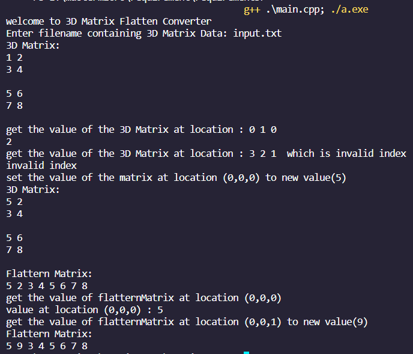

# Matrix Flatten
### C++ application Convert 3D matrix into Flatten 1D vector
### Convert the 3D matrix index (i, j, k) to a suitable 1D vector index (y). Must be O(1).

## Technology
  * ```C++```\

## Use Program
  *```git clone git@github.com:Ahmed-Mohamed7/MasterMicroTasks.git```\
  *``` cd task 3
  *``` g++ .\main.cpp; ./a.exe ```
  
## OutPut Example

